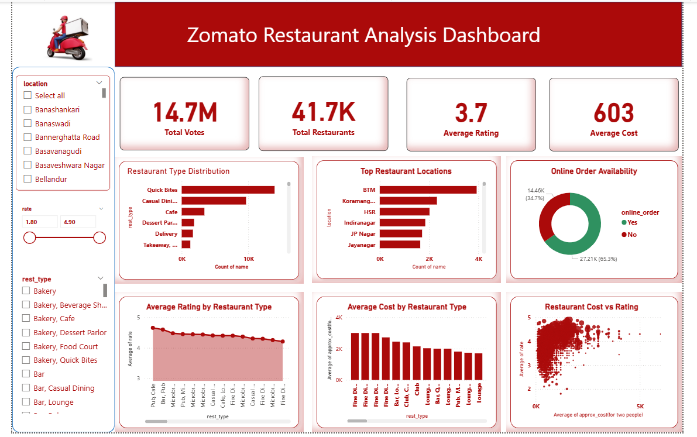

# 🍽️ Zomato Restaurant Analysis

## 📌 Project Overview
Analyzed 41,665 Zomato restaurant records from Bengaluru using Python, SQL, and Power BI to generate actionable business insights on restaurant performance, ratings, costs, and customer preferences.

## 🛠️ Tools & Technologies
- **Python** — Data cleaning & EDA (Pandas, Matplotlib, Seaborn)
- **MySQL** — 13 SQL queries including Window Functions
- **Power BI** — Interactive dashboard with DAX measures
- **GitHub** — Version control

## 📊 Dashboard Preview

## 🔍 Key Insights
- BTM location has highest restaurant density (3,930 restaurants)
- 65.3% of restaurants support online ordering
- Most restaurants rated between 3.5 - 4.0
- North Indian is most popular cuisine (2,200+ restaurants)
- Most restaurants are budget friendly (₹200-₹500 for two)
- Higher cost restaurants generally maintain better ratings

## 🧹 Data Cleaning
- Handled 7,775 missing ratings
- Cleaned rate column (removed '/5', converted to float)
- Removed commas from cost column
- Filled missing values in dish_liked, cuisines, rest_type

## 📈 SQL Queries Included
- Top locations by restaurant count
- Average rating by location
- Window functions — ROW_NUMBER, AVG OVER, SUM OVER
- Budget gems (high rating + low cost)
- Premium restaurants analysis

## 📉 DAX Measures
- Total Restaurants, Total Votes
- Average Rating, Average Cost
- Online Order Count, Book Table Count
- Total Locations, Total Cuisines

## 📁 Files
| File | Description |
|------|-------------|
| Zomato_Restaurant_Analysis.ipynb | Python cleaning & EDA |
| Zomato_Restaurant_Sql_queries.sql | 13 SQL queries |
| Zomato_Powerbi.pbix | Power BI dashboard |
| dashboard.png | Dashboard screenshot |
